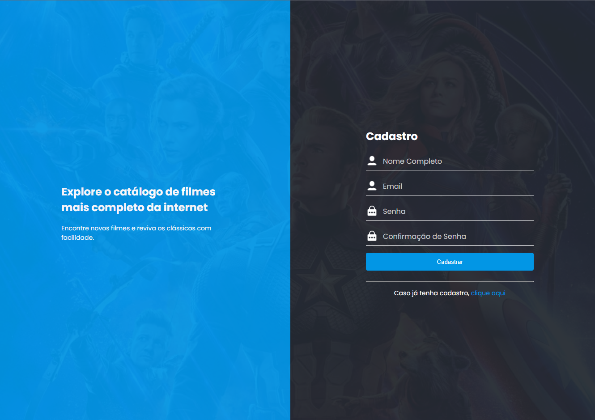
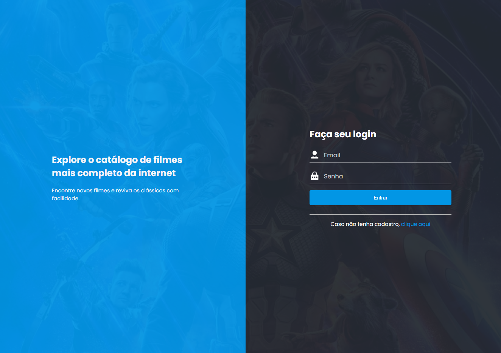

# Teste de Aplicação com React 18, TypeScript, Vite, Zustand e Catálogo de Filmes

Este é um projeto de teste que desenvolvi para demonstrar como utilizar algumas das tecnologias mais modernas no desenvolvimento web. O projeto é um **Catálogo de Filmes** com funcionalidades de login, cadastro, listagem de filmes, cache e paginação. Abaixo você encontrará uma descrição detalhada das tecnologias utilizadas e como rodar a aplicação localmente.

## Visão Geral

O projeto chama-se **Catalog** e é uma aplicação simples que permite ao usuário se cadastrar, fazer login e acessar um catálogo de filmes. A aplicação foi construída com **React 18** e **TypeScript** para garantir alta performance e maior confiabilidade. O **Zustand** foi escolhido para o gerenciamento de estado, pois é leve, fácil de usar e tem excelente desempenho.

### Funcionalidades principais:
- **Login e Cadastro**: O usuário pode se registrar e os dados são salvos no `sessionStorage` para garantir que o cadastro persista durante a sessão ativa.
- **Listagem de Filmes**: Filmes são carregados da The Movie Database (TMDB) API e exibidos com informações como imagem e título.
- **Cache e Paginação**: A listagem de filmes tem paginação para navegar pelas páginas, além de um sistema de cache que armazena as páginas já carregadas, tornando a navegação mais rápida.

## Tecnologias Utilizadas
- **React 18**: A versão recente mais estável do React.
- **TypeScript**: Utilizado para garantir uma tipagem forte e prevenir erros, melhorando a confiabilidade e a manutenibilidade do código.
- **Vite**: Um bundler super rápido que acelera o processo de desenvolvimento, tornando a aplicação ainda mais ágil.
- **Zustand**: Uma biblioteca de gerenciamento de estado minimalista, que facilita a manipulação de dados de forma eficiente sem a complexidade do Redux.
- **SessionStorage**: Usado para salvar temporariamente os dados de cadastro, mantendo-os enquanto a sessão do navegador estiver ativa.

## Funcionalidades

A aplicação foi projetada para ser simples, mas robusta. Aqui estão as funcionalidades implementadas:

- **Gerenciamento de Estado com Zustand**: Utilizamos Zustand para gerenciar o estado global da aplicação de forma simples e eficiente, sem a sobrecarga de outras bibliotecas como Redux.
- **Carregamento de Dados Assíncronos**: Os dados dos filmes são carregados da The Movie Database (TMDB) API, com o uso de funções assíncronas.
- **Roteamento com React Router**: A navegação entre as páginas é feita de maneira fluida e eficiente.
- **Login e Cadastro**: O usuário pode se registrar e fazer login, e seus dados de cadastro são mantidos no `sessionStorage`.
- **Cache e Paginação**: A aplicação possui uma funcionalidade de cache para armazenar dados de páginas já acessadas, além de permitir navegar entre diferentes páginas de filmes.

## Como Rodar a Aplicação

Quer rodar o projeto na sua máquina? Aqui está um passo a passo simples para começar.

### 1. Clonar o repositório

Primeiro, você precisa clonar o repositório para sua máquina local. Abra seu terminal e execute o seguinte comando:

git clone https://github.com/MatCorreia/catalog.git

### 2. Acessar a pasta do projeto

cd catalog

### 3. Instalar dependências

npm install

### 4. Rodar a aplicação localmente

npm run dev

### 5. Ao rodar a aplicação é necessário cadastrar primeiramente

### 6. Logue

